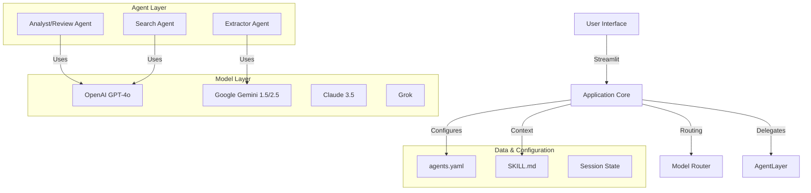

# Comprehensive Technical Specification: Agentic AI System for Medical Device Documentation

## 1. Executive Summary

This document defines the technical specifications for a comprehensive **Agentic AI System** designed to revolutionize the processing, management, and review of medical device documentation. By integrating Large Language Models (LLMs) with a modular agentic architecture, the system automates labor-intensive tasks such as PDF extraction, regulatory compliance checks, and cross-document analysis. 

The system is built on a **Streamlit** frontend hosted on **Hugging Face Spaces**, utilizing a multi-model backend (OpenAI, Gemini, Anthropic, Grok) to ensure robustness and adaptability. It addresses the critical need for "Regulatory Intelligence" by transforming unstructured data (IFUs, Premarket Applications) into structured insights, enabling manufacturers and regulatory bodies to accelerate decision-making steps.

## 2. System Architecture

The system adopts a **Micro-Agent Architecture**, where discrete, specialized agents perform specific tasks under the coordination of a central application logic.

### 2.1 High-Level Diagrams



### 2.2 Core Components

1.  **Application Core (app.py)**: The central controller managing user session state, routing logic, and UI rendering. It handles file I/O (PDF, DOCX, CSV) and orchestrates the flow of data between the user and the agent layer.
2.  **Model Router**: A dynamic extraction layer that abstracts API differences between providers (OpenAI, Google, Anthropic, xAI). It manages API keys, context windows, and model-specific parameters.
3.  **Agent Logic (agents.yaml & SKILL.md)**: 
    -   `agents.yaml` defines the "Persona" of each agent (Name, Role, Model, Capabilities).
    -   `SKILL.md` serves as the "Knowledge Base," providing few-shot examples, regulatory guidelines, and prompts.
4.  **UI/UX Engine**: A highly customizable interface supporting dynamic theming ("Painter Styles") and localization (English/Traditional Chinese).

## 3. Functional Requirements

### 3.1 Dashboard & Analytics
**Requirement:** Provide a high-level view of system usage and performance.
-   **Features**:
    -   Real-time metrics: Total Runs, Unique Tabs, Tokens Processed.
    -   Visualizations: Altair charts showing usage by Tab, Model, and Time.
    -   "WOW Status Wall": A gamified card displaying the most recent high-impact activity.

### 3.2 Intelligent Document Processing (IDP)
**Requirement:** Convert unstructured PDF/Word documents into structured formats.
-   **PDF Extraction**: 
    -   Support for partial page extraction.
    -   Integration with `pypdf` for text harvesting.
    -   OCR capabilities (via LLM vision models) for scanned documents.
-   **Structure Generation**:
    -   Convert extracted text into Markdown or JSON.
    -   Key entity extraction: License No., Manufacturer, Intended Use, Contraindications.

### 3.3 Medical Device Application Management (TW Premarket)
**Requirement:** Streamline the creation and validation of Taiwan FDA premarket applications.
-   **Data Model**: A comprehensive schema covering 40+ fields (e.g., `doc_no`, `apply_date`, `manu_name`, `indications`).
-   **Session Persistence**: Automated saving of form state to session storage.
-   **Validation**: Real-time checks for required fields (e.g., Medical Device Code format).

### 3.4 Agentic Workflows & Configuration
**Requirement:** Allow users to define and execute custom agent behaviors.
-   **Dynamic Configuration**: Users can upload a custom `agents.yaml` to redefine agent roles on the fly.
-   **Interactive Execution**:
    -   Input: Text/Markdown or File content.
    -   Controls: Model selection, Max Tokens, Temperature.
    -   Output: Editable Markdown/Text.

### 3.5 510(k) Intelligence & Review Pipeline
**Requirement:** Assist in the review of US FDA 510(k) submissions.
-   **Review Guidance Integration**: Users can upload specific review guidance checklists.
-   **Automated Review**: Agents compare application documents against the guidance.
-   **Summary Generation**: Creation of executive summaries highlighting gaps or compliance issues.

## 4. Data Architecture

### 4.1 Data Schemas

**Agent Configuration (`agents.yaml`) Schema:**
```yaml
agents:
  - name: String (Unique ID)
    role: String (Display Name)
    model: String (Default Model ID)
    system_prompt: String (Core Instructions)
    skills: List[String] (Reference to SKILL.md sections)
    max_tokens: Integer
```

**Application Entity Model (Partial):**
```json
{
  "doc_no": "String (Application Number)",
  "apply_date": "Date (YYYY-MM-DD)",
  "device_category": "Enum (Class II/III)",
  "manufacturer": {
    "name": "String",
    "country": "String",
    "address": "String"
  },
  "product": {
    "name_en": "String",
    "name_zh": "String",
    "intent": "String"
  }
}
```

### 4.2 Storage Strategy
-   **Ephemeral**: Session State (`st.session_state`) is used for active user data.
-   **Persistent (Optional)**: Integration with Hugging Face Dataset or external databases (PostgreSQL/Supabase) for long-term record keeping (future scope).

## 5. Interface Design & UX Experience

### 5.1 Design Philosophy
The system prioritizes "Visual Excellence" and "responsiveness".
-   **Painter Styles**: A unique theming engine that injects CSS variables based on artistic styles (e.g., "Van Gogh" - Starry Night palette, "Monet" - Pastel gradients).
-   **Dark/Light Mode**: Full support for system-preferred color schemes with high-contrast overrides.

### 5.2 Key Interface Elements
-   **Sidebar**: Global settings (API keys, Theme, Language) and Agent Configuration upload.
-   **Main Stage**: Tabbed interface separating major functional areas (Dashboard, Application Form, Agent Runner).
-   **Feedback Loops**: Visual status indicators (Pending/Running/Done/Error) with color-coded badges.

## 6. Technology Stack & Dependencies

| Category | Technology | Purpose |
| :--- | :--- | :--- |
| **Frontend Framework** | Streamlit | Rapid UI development, Python-native. |
| **Runtime** | Python 3.10+ | Core logic execution. |
| **LLM Providers** | OpenAI API | GPT-4o models for reasoning. |
| **LLM Providers** | Google Gemini API | Flash models for high-context processing. |
| **LLM Providers** | Anthropic API | Claude 3.5 Sonnet for nuanced writing. |
| **LLM Providers** | xAI API | Grok models for alternative reasoning. |
| **Document Processing** | `pypdf`, `python-docx` | Text extraction from binary formats. |
| **PDF Generation** | `reportlab` | Creating standardized reports. |
| **Visualization** | Altair | Interactive dashboards. |
| **Configuration** | YAML, JSON | System and data config. |

## 7. Security & Compliance

### 7.1 API Key Management
-   **Environment Variables**: Primary method for production deployment (Hugging Face Secrets).
-   **User Input**: Fallback UI input for local/testing scenarios. Keys are stored only in volatile memory (`st.session_state`) and never logged.

### 7.2 Data Privacy
-   **Zero-Persistence Default**: By default, no user data is saved to disk. All processing happens in-memory.
-   **Sanitization**: Agent prompts are constructed dynamically and discarded after execution.

## 8. Deployment Strategy

### 8.1 Hugging Face Spaces
-   **Containerization**: Docker-based deployment using the official Streamlit image.
-   **Secrets Management**: API keys managed via Spaces Settings.
-   **Resource Allocation**: Recommended T4 GPU or high-CPU instance if running local embedding models (though currently API-dependent).

### 8.2 CI/CD Pipeline
-   **Linting**: `ruff` or `flake8` for code quality.
-   **Testing**: `pytest` for unit tests of helper functions (PDF extraction, text formatting).
-   **Automated Deploy**: GitHub Actions sync to Hugging Face Spaces.

## 9. Future Roadmap

1.  **Multi-Modal Agents**: Enable agents to "see" diagram/flowcharts in PDF IFUs directly using Gemini Pro Vision.
2.  **Vector Database Integration**: Implement RAG (Retrieval-Augmented Generation) for querying large regulatory corpuses (e.g., FDA guidance database).
3.  **Collaborative Review**: Enable multiple users to annotate and comment on the same application session via shared state (using Redis/Firebase).
