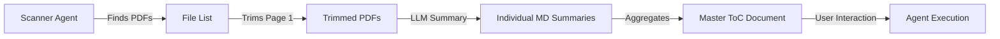

# Technical Specification: Automated PDF Discovery & Agentic Intelligence System

## 1. Introduction

This specification details the architecture and requirements for an **Automated PDF Discovery & Agentic Intelligence System**. Designed for high-volume document environments, this system autonomously scans directories, processes PDF content, and generates synthesized knowledge bases (Table of Contents) that serve as a launchpad for further Agentic AI analysis. It is deployed as a Streamlit application on Hugging Face Spaces.

## 2. System Architecture

### 2.1 Workflow


### 2.2 Core Components
1.  **Discovery Module**: Recursive file scanner.
2.  **Processing Pipeline**: `pypdf` trimming and LLM-based summarization.
3.  **Knowledge Synthesis**: Markdown aggregation engine.
4.  **Agent Interface**: Interactive chat and execution environment on the generated ToC.

## 3. Functional Requirements

### 3.1 PDF Discovery & Trimming
**Requirement**: "System will first find all pdf files in the working folder. Then system will trim frist page..."
-   **Scanning**: Button "Scan Directory" triggers a recursive search (`glob` or `os.walk`) for `*.pdf`.
-   **Trimming**:
    -   For each found PDF, extract **Page 1 only**.
    -   Rationale: The first page usually contains the abstract, title, and key metadata.
    -   Output: Temporary stream or cached `page1_{filename}.pdf`.

### 3.2 Automated Summarization
**Requirement**: "Create summary of each trimmed files in markdown (save in .md)."
-   **Batch Processing**:
    -   Iterate through trimmed pages.
    -   **Extract Text**: Convert Page 1 to text.
    -   **Generate Summary**: Call LLM (e.g., Gemini Flash for speed) with a prompt: "Summarize the key contents of this document based on the first page."
    -   **Persistence**: Save specific summary files (e.g., `summary_{filename}.md`) alongside the originals or in a dedicated `output/` folder.

### 3.3 Table of Contents (ToC) Generation
**Requirement**: "Create a table of content doc (ToC doc) in markdown combined all previous created summary."
-   **Aggregation**:
    -   Concatenate all individual summaries.
    -   Add hyperlinks to the original files (if accessible via static serving) or relative paths.
    -   Format:
        ```markdown
        # Master Table of Contents
        
        ## 1. [Filename A]
        **Summary**: ...
        
        ## 2. [Filename B]
        **Summary**: ...
        ```
-   **Editor**: Display the Master ToC in an editable text area (`st.text_area`).

### 3.4 Agentic Execution on ToC
**Requirement**: "User can keep prompt on the ToC doc... or select agents from agent.yaml to execute on the ToC doc."
-   **Context**: The "Master ToC Document" becomes the primary context (Input Text) for the agent.
-   **Agent Selection**: Dropdown list populated from `agents.yaml`.
-   **Prompt Engineering**:
    -   User can type a specific prompt (e.g., "Based on this ToC, which documents relate to Cardiac Rhythm Management?").
    -   **"Keep Prompt"**: Checkbox to append the user's prompt and the agent's answer to the bottom of the ToC document, effectively growing the knowledge base.

### 3.5 Deployment & Configuration
**Requirement**: "Hugging Face Space using Streamlit, SKILL.md, agents.yaml, OPENAI API, GEMINI API."
-   **Configuration**:
    -   `agents.yaml` defines available agents.
    -   `SKILL.md` defines global system instructions.
-   **API Security**:
    -   Check Environment Variables first.
    -   If missing, show password input fields in the Sidebar.
    -   Never display keys in plain text; use formatting to mask them if loaded from env (e.g., `sk-****`).

## 4. UI/UX Design

### 4.1 Dashboard Layout
-   **Header**: Real-time stats (Files Found, Processed, Tokens Used).
-   **Control Panel**:
    -   "Start Discovery" Button.
    -   Model Selectors for the summarization task.
-   **Workspace**:
    -   **Tab 1: Discovery Log**: Real-time list of processed files.
    -   **Tab 2: Master ToC**: The editable markdown document.
    -   **Tab 3: Agent Interaction**: Split screen—ToC on left, Chat/Agent output on right.

## 5. Technical Implementation Details

### 5.1 File Scanning Logic
```python
def scan_and_process(root_dir):
    pdf_files = glob.glob(os.path.join(root_dir, "**/*.pdf"), recursive=True)
    summaries = []
    
    for pdf_path in pdf_files:
        # 1. Trim Page 1
        reader = PdfReader(pdf_path)
        page_1_text = reader.pages[0].extract_text()
        
        # 2. Summarize
        summary = call_llm(
            model="gemini-2.5-flash",
            prompt=f"Summarize this:\n{page_1_text}"
        )
        
        # 3. Save Summary
        save_markdown(f"{pdf_path}.summary.md", summary)
        summaries.append(f"## {os.path.basename(pdf_path)}\n{summary}")
        
    return "\n\n".join(summaries)
```

### 5.2 Agent Execution Loop
-   **Input**: `Master ToC` (Context) + `User Prompt`.
-   **Process**:
    -   Load Agent definition (System Prompt + Model).
    -   Construct Message: `System: {agent_role}\nUser: {context}\n\nTask: {prompt}`.
    -   Stream response.
-   **Post-Process**: If "Keep Prompt" is active, append `\n\n### User Question: {prompt}\n\n**Answer:** {response}` to the ToC document.

## 6. Future Enhancements
-   **Incremental Updates**: Only process new PDFs since the last scan.
-   **Vector Search**: Embed the summaries for semantic retrieval instead of just linear scanning.
